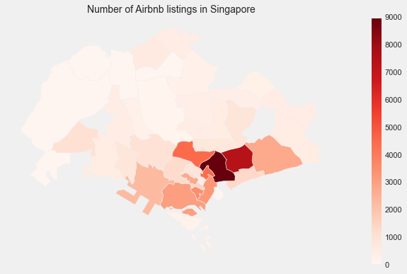
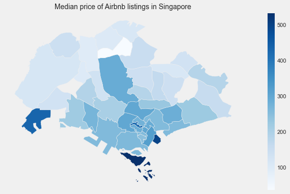

# Capstone Project: Airbnb Price Prediction for Singapore

---

## Context and Problem Statement

The motivation for this project stemmed for scrolling through the Airbnb app looking at listings. For most of us, we actively seek out listings just before heading to our favourite destinations, with countless of options to suit our preferences.But what if the roles were switched, what if we had an apartment to list. How do we go about pricing it? Thus, with the data science skills that i've picked up over this course, I thought, how amazing would it be to be able help provide a solution to this problem?

Focusing solely on Singapore, my home country for this particular project, I set out with a goal:

+ Be able to predict listing prices with high accuracy
+ To find out the features that would contribute to the price

Some reseach on the problem:

Air-bed and breakfast, or Airbnb fo short is an online marketplace which lets people rent out their properties and even spare rooms to guests. It connects people who are looking to rent their homes with people who are looking for accommodations.

For potential new listers, they might not be aware of the market or pricing techniques of competitors. Because of this, it might deter them from listing their apartments or rooms on the platform, depriving those looking for an apartment as well as a source of income for those with rooms to spare. Thus, I am looking to build a regression model that would provide an estimation of price based on the provide features. The model performance will be guided by RMSE, and the model should at least improve upon baseline by 10%. The baseline is defined as the average daily cost per night for a housing listing in Singapore.

---

## Contents:
- Data Import & Cleaning
    + Data Cleaning: Initial Check
    + Data Cleaning: Dropping Initial Columns
    + Data cleaning: Null Values
    + Data Cleaning: According to Type
- Exploratory Data Analysis
    + Distribution of Target Value - Price
    + Categorical Features
    + Numerical Features
- Preprocessing
    + Train Test Split Data
- Modelling]
    + Model 1: Linear Regression
    + Model 2: Neural Network
    + Model 3: XGBoost
- Summary and Recommendations

---

## Data Import & Cleaning

The following dataset were given and cleaned :

- listings.csv: Summary information and metrics for listings in Singapore (compiled on 21st March 2020).

- neighbourhoods.geojson: GeoJSON file of neighbourhoods of the city.

---

## EDA:

---

### Baseline Score:

Baseline: $116 SGD per night

---

### Modelling Results

| |Linear Regression|Lasso|Neural Network|XGBoost
|---|---|---|---|---|
|Train MSE|-|-|0.0992|0.0674|
|Test MSE|-|-|0.1618|0.1222|
|Train R2|-1.66e+25|0.6732|0.8334|0.8868|
|Test R2|-|0.6643|0.7118|0.7825|

---

### Summary

#### Top 5 features with impact to the listing price for Airbnb Singapore
The room type being an **entire home/apartment** tops the list as the most significant value added feature to the listing price. The number of bedrooms and whether the place comes with a TV also value added to the listing price. The number of accomodates the listing is able to hold is also one of the key factor that adds value to the listing price.

#### Neighborhoods with positive impact to listing price

Downtown Core, Southern Islands and Geylang are the 3 neighborhoods that potentially have positive impact to listing prices.

### Recommendation

The room type in this case is the key to the listing price, as it seems that listing the place as a entire home/apartment as compared to a hotel, private or shared room would be priced higher. Based on the model, taking note of the number of bathrooms, beds and bedrooms a listing has would also improve the value of the place. Another factor that should not be neglected is the general zoning of the listings as well. Listings tend to have a higher value located at the central regions.

### Conclusion

The model is generally able to predict well the listing price in Singapore. However, it would require some changes if it were to be applied to other countries as there are quite a number of influencing factors that are unique to Singapore. This would include, the neighbourhood, etc. Furthermore, the baseline housing price per night in other cities maybe priced differently from Singapore. Instead of revising the model, new dataset on the other city is needed to do the modeling, but could consider using the similar approach learn here.

---
