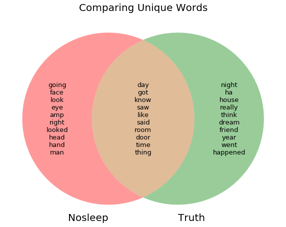

#  

# Project 3: Web APIs & Classification

### Context and Problem Statement

To scrape two subreddits `NoSleep` (fictional horror stories) and `TheTruthIsHere` (true personal encounters with the unknown) through a webscrapper. Through this the scraped data from the two subreddits were passed through separate classification models, **CountVectorizer/TfidVectorizer** with **Bayes Classifier** and **LogisticRegression** that will assign each observation to the most likely class of subreddit. The model should help the data science marketing team identify what makes the respective posts unique.

In this process, the subreddit posts will undergo preprocessing and EDA. The success of the model will be determined through the highest accuracy based on the scores obtained. 

---

## Executive Summary

This Jupyter notebook walks through the clean up of the subreddit datasets and explores various models. 

**TheTruthIsHere** consist of personal paranormal encounters and has 250 thousand subscribers.
**NoSleep** is made up of fictional horror stories and has more than 13.8 million subscribers.  
The reddit posts for NoSleep garners tens of thousands of readers in a single day. Coming from the perspective of a marketing company, this would be a good outlet to posts advertisements or market products to the public. The amount of time one spends on the internet reading such posts would definitely be a good area to target. As such, my team would like to identify what attracts viewers to **fictional** horror posts compared to **real** personal paranormal encounters.  

Through this we hope to understand the keywords that can help us differentiate the two different subreddit posts and to identify possible keywords that would help make a post more attractive to potential readers as a platform to market products. After all, there is nothing scarier than a true horror story. :') 

### Contents:
- [Data Import & Cleaning](#Data-Import-&-Cleaning)
- [Preprocessing](#Preprocessing)
- [EDA & Modeling](#EDA-&-Modeling)
- [Evaluation and Conceptual Understanding](#Evaluation-and-Conceptual-Understanding)
- [Conclusions and Recommendations](#Conclusions-and-Recommendations)
---

### EDA:

After cleaning and combining the content of the datasets from webscrapping, we have created a venn diagram to show the words that are unique and common between the two posts.

### Modelling Results

| |CVEC + NB|TVEC + NB|
|---|---|---|
|Train|0.8824|0.8824|
|Test|0.8699|0.8718|
|Accuracy|0.87|0.872|
|ROC|0.896|0.937|

| |CVEC + LR|TVEC + LR|
|---|---|---|
|Train|0.9958|0.9441|
|Test|0.9087|0.9184|
|Accuracy|0.909|0.918|
|ROC|0.947|0.979|

#### Baseline Score:

|Target Variable|Normalized Counts|
|---|---|
|1|0.541459|
|0|0.458541|

**0 for `TheTruthIsHere` posts and 1 for `NoSleep` posts**

### Conclusions and Recommendations:

In conclusion, despite given the similar genre of the two posts, the two posts do have their own set of rather unique words that helped to predict on unseen data the type of post it belongs to.

It is interesting to note that posts that belong to `NoSleep`(fictional horror stories) tend to contain words such as 'hand', 'head' and 'eye'. Whereas personal paranomal encounters from the `TheTruthIsHere` posts tend to include words such as 'house', 'dream' and 'friend'.

Through this the marketing team is able to differentiate reasonably between true horrror stories and fictional ones with 92% accuracy. This will help us to create stories with targeted keywords to attract more people to the viewing page where our items are being marketed. 

In the future, we can make use of the GridSearch model to determine the best parameters for our models to obtain the best optimized model.

---

### Sources:

- [NoSleep Subreddit](https://www.reddit.com/r/nosleep/)
- [TheTruthIsHere Subreddit](https://www.reddit.com/r/Thetruthishere/)
- [The internet's scariest place: NoSleep, Reddit's band of horror enthusiasts](https://www.theguardian.com/technology/2015/oct/26/nosleep-reddit-scariest-place-on-the-internet)

