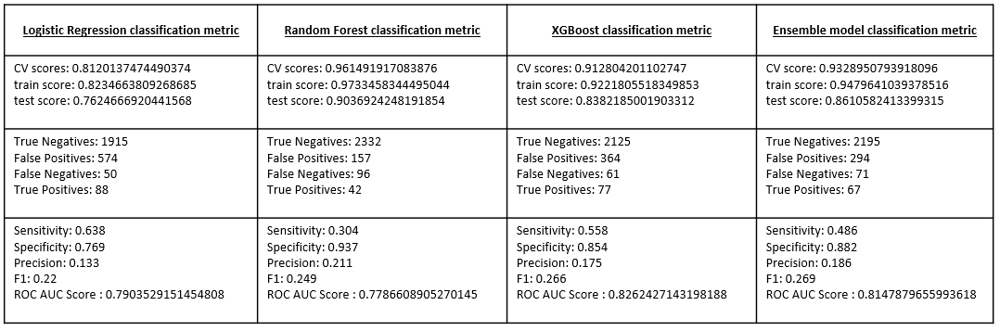
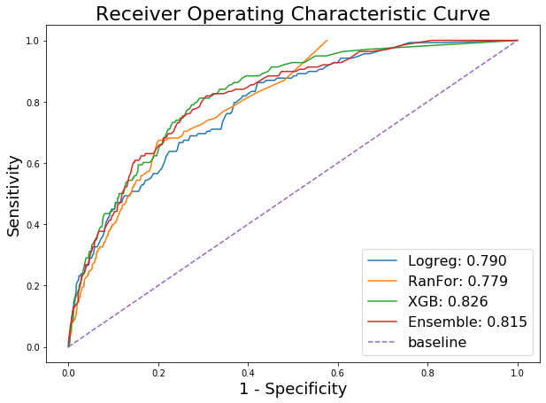
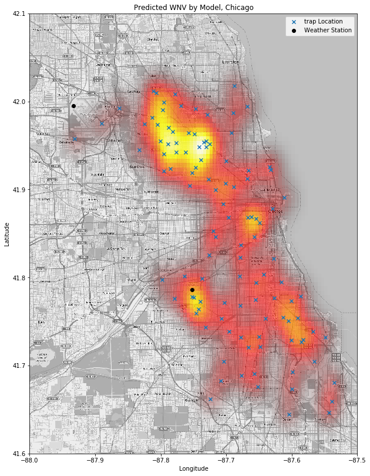
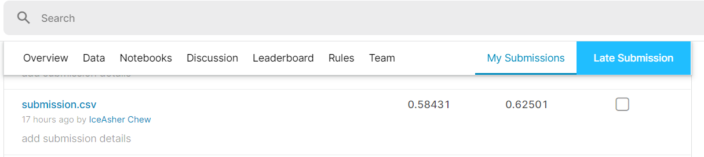

# 

# Project 4: West Nile Virus
---

## Problem Statement

The West Nile virus (WNV) is most commonly spread to humans through infected mosquitos. Around 20% of people who become infected with the virus develop symptoms ranging from a persistent fever, to serious neurological illnesses that can result in death.

Every week from late spring through the fall, mosquitos in traps across the city are tested for the virus. The results of these tests influence when and where the city will spray airborne pesticides to control adult mosquito populations.

Given weather, location, testing, and spraying data, we will build a model to predict when and where different species of mosquitoes will test positive for WNV. This aims to be a  more accurate method of predicting outbreaks of WNV in mosquitos. In turn, this will help the City of Chicago and CPHD allocate resources more efficiently and effectively, striving towards preventing transmission of this potentially deadly virus.

Our model performance will be guided by the ROC AUC score to distinguish between the classes (WNV, NoWNV).

---

## Executive Summary

This Jupyter notebook walks through the clean up of the West Nile Virus datasets and explores various models.

Our goal is to predict the **presence of the West Nile Virus** (using the various variables provided) in mosquito traps to inform pesticide use.

We started by examining the different datasets and coming up with an overall framework on how we should approach the data cleaning process before splitting up the data cleaning work. We then combined the test, train and spray datasets and performed data visualisation and feature engineering on the combined dataset. The imbalanced dataset is a key challenge and we have attempted to address this with random oversampling.

Various modelling tools were used including Linear Regression, Random Forest, XGBoost and an ensemble of the three by max voting.  **XGBoost** was selected based on the best **ROC score of  0.826** with a **sensitivity of 0.558**. A separate reference to Kaggle score of 0.625 was achieved with our model.

As there is no cure for WNV and the economic cost of WNV infection is high (USD$3M in 2005 for Sacramento County, California alone), prevention may be a more effective means of virus prevention.  We recommend to launch education campaigns at hotspot neighbourhoods to nip larvae growth in the bud. Besides inculcating proactive behaviour and habits to remove stagnant water, broadcasting information to self-protect during days/ months where mosquito count is expected to peak will also help to mitigate WNV infections.

---

## Contents:

- [Data Import & Cleaning](#Data-Import-&-Cleaning)
- [Preprocessing](#Preprocessing)
- [EDA & Modeling](#EDA-&-Modeling)
- [Evaluation and Conceptual Understanding](#Evaluation-and-Conceptual-Understanding)
- [Conclusions and Recommendations](#Conclusions-and-Recommendations)
---

## Data Import & Cleaning

The following datasets were given and cleaned :

- train.csv, test.csv: The training and test sets of the main dataset. The training set consists of data from 2007, 2009, 2011, and 2013, while we are required to predict the test results for 2008, 2010, 2012, and 2014.

- spray.csv: Geospatial data of spraying efforts in 2011 and 2013. Contains 584 null values in time column.

- weather.csv: Weather data from 2007 to 2014. Contains missing values in several columns.
---

## EDA:

After cleaning and looking through our datasets, there were several findings:

West Nile Virus Rate by **Month and Year** : The number of mosquitos peaked in June and reduced as the summer progresses. 2007 has the highest number of WNV cases perhaps due to ideal conditions that led to more mosquitos being bred.

West Nile Virus Rate by **Species and Temperature** : The Northern House Mosquito, Culex Pipiens, appears to be the primary carrier of the West Nile Virus. Consequently, a hot, dry summer increases the risk of West Nile Virus Infection.

It is known that warmer temperatures, elevated humidity, and heavy precipitation results in an increase in the relative rate of human WNV infection. At a higher dew point temperature, we observe the presence of the WNV. We also observe the presence of WNV among the Culex species when the wet bulb temperature ranges from 60°F - 70°F.

**How effective is spraying?**

An independent sample T-test was conducted on spray and non-spray training data. Although spray data was from 2011-2013, we did not compare across the year as a pair sample with-in subject design requires the same sample size. This indicates that we can assume independence. T-test shows that there is a significant difference in number of mosquitoes (p < 0.00). It seems that there are more mosquitoes when we spray.

This could be because we have started spraying because there was an increase in mosquitoes, not that the spraying has increased the number of mosquitoes.
However, this may be a hint that we need more measures in place. For instance, education such as eliminating stagnant water, enforcements and fines for non-compliance or an increase in spraying frequency.

---

## Modelling Results

#### Baseline Score:

|Target Variable|Normalized Counts|
|---|---|
|1 (WNV Present)|5.25%|
|0 (WNV Not Present)|94.7%|

Our model indicated good prediction based on the Receiver Operating Characteristic (ROC) Curve of 0.826. Sensitivity was calculated as the proportion of positive WNV correctly identified by the model and yielded 0.558. Specificity was calculated as the proportion of negative WNV correctly identified by the model and yielded 0.854.

---

## Conclusions and Recommendations:

There is no vaccine or specific antiviral treatments for West Nile virus infection. In some severe cases, patients need to be hospitalized to receive treatment- such as intravenous fluids, pain medication, and nursing care. In addition to threatening lives, outbreaks of WNV in the United States are very costly in terms of both medical treatment and event control. A case in point is the 2005 outbreak in Sacramento County, California. 163 human cases were reported and the economic impact of the outbreak cost approximately US$2.28 million for medical treatment and loss of productivity of the patients. Vector control including spray procedures and overtime hours was about $700,000.

**Preventive Action** We propose to launch education campaigns at hotspot neighbourhoods to nip larvae growth in the bud. Besides inculcating proactive behaviour and habits to remove stagnant water, broadcasting information to self-protect during days/ months where mosquito count is expected to peak will also help to mitigate WNV infections.

The figure above shows our prediction of where the WNV will be present based on variables in an unseen dataset. In conclusion, our model may help to identify where in Chicago will be vulnerable to WNV. In doing so, we hope to bring down the expenditure associated with spraying by providing accurate information on where and when spraying is required. Targeted spraying as compared to random and massed spraying is less harmful for the environment as well.

---

## Limitations:

Our model is not without limitations. Firstly, the highly imbalanced data set may have hindered our models performance. Unfortunately, our model was unable to beat the baseline accuracy of 94.7%. Our model yielded an accuracy score of 92.2%. Despite this shortfall, our model would have still perform better than the naive guess as accuracy scores are poor evaluation metrics for highly imbalanced class. The baseline model would have yeilded an extremely low recall while having high specificity due to the imbalanced classes. Thus, the baseline accuracy scores will only capture classes we are not interested in. As such, we evaluated that beating the baseline was the not as important and that our team will take the ROC-AUC as the main evaluation metric.

One of the solutions to this is to get more data. Another might be to explore other features or engineer different features. A time-series or spatial analysis may also provide us with an additional layer of information that will help us make more accurate predictions. 

---

## Kaggle Submission ROC-AUC score:

### Sources:

- [West Nile Virus Prediction](https://www.kaggle.com/c/predict-west-nile-virus/overview)

- [Economic Cost Analysis of West Nile Virus Outbreak, Sacramento County, California, USA, 2005](https://www.ncbi.nlm.nih.gov/pmc/articles/PMC3322011/)

- [West Nile Virus Symptoms](https://www.cdc.gov/westnile/symptoms/index.html)

---
